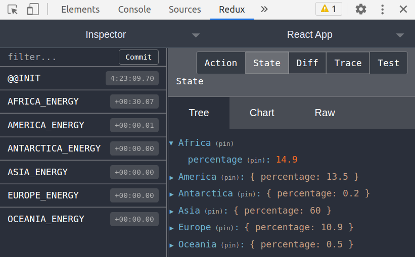

## Configurando o Redux com React

É necessário, em primeiro lugar a criação de uma aplicação React:

```
npx create-react-app MyAPP
```

Lembrando que subistituimos `MyApp` pelo nome da aplicação a ser criada.

O próximo passo é a instalação das dependências do Redux:

```
npm install redux react-redux
```

> *Redux* é a biblioteca que possui a implementação do **Redux**. *React-Redux* é a biblioteca que realiza a conexão entre **Redux** e **React**.

&nbsp;

# Usando o Redux no React

Configurada a aplicação, o primeiro passo é definir o **store**. Esse store pode ser criado em uma pasta, dentro do *source* da aplicação. Algo como `src/store/index.js`, como o conteúdo a seguir:

```
import { createStore, combineReducers } from 'redux';
import rootReducer from '../reducers;

const store = createStore(rootReducer);

export default store
```

É possível notar que a criação do **store** depende de um *Reducer*, chamdo **rootReducer**. Portanto, é necesário que esse reducer exista e podemos localizá-lo no arquivo `src/reducers/index.js`.

Aqui, defendemos o uso da extensão **Redux Devtools** e o uso do pacote de exensões com o comando:

```
npm install --save redux-devtools-extension
```
Com essa extensão instalada, a criação da **store** pode ser feitada seguinte maneira:

```
import { createStore } from 'redux;
import { composeWithDevTools } from 'redux-devtools-extension;

import rootReducer drom '../reducers';

const store = createStore(rootReducer, composeWithDevTools());

export default store;
```

[]

## Reducer & rootReducer

Como vimos, nossa função *createStore* recebeu um parâmetro chamado *rootReducer*. Esse último objeto será responsável por **receber todos os reducers da aplicação como um objeto**, endo este um parâmetro da função *combineReducers*.
